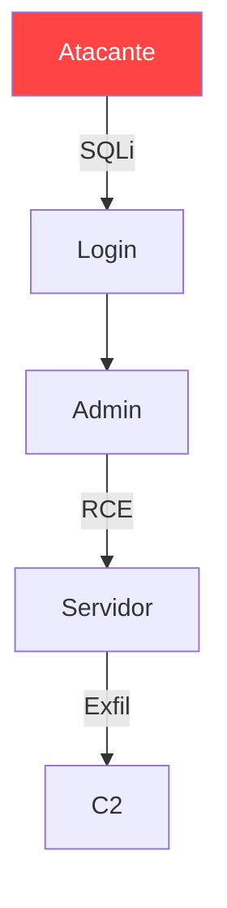

# Report Manager — Gestión de Reportes Profesionales

> **Autor:** Lucciano Campassi (D4rkDr4g0n)  
> **Propósito:** Generación de reportes para pentesting, forense, auditoría y resúmenes ejecutivos  
> **Plataformas:** Linux (Arch) / Windows 11

---

## Descripción general

| Tipo | Audiencia | Extensión |
|------|-----------|-----------|
| Pentest Report | Técnica + Gerencia | 30–80 págs |
| Forensic Report | Técnica + Legal | 40–100 págs |
| Audit Report | Mixta | 20–50 págs |
| Executive Summary | C-level | 2–5 págs |
| Vulnerability Advisory | Técnica | 1–3 págs/hallazgo |

**Ciclo de vida:** Recolección → Redacción → Revisión interna → Revisión cliente → Entrega final → Archivo cifrado

---

## Plantillas de reportes

### Frontmatter YAML estándar

```yaml
---
title: "Pentest Report — [Cliente]"
project_id: "PT-2026-001"
classification: "CONFIDENCIAL"
version: "1.0"
date: "2026-06-05"
author: "Lucciano Campassi — D4rkDr4g0n"
client: "[Nombre]"
engagement_type: "Caja Negra"
scope: |
  - 10.0.0.0/24
  - app.cliente.com
tools: [Nmap 7.95, Burp Suite Pro 2026.3, Metasploit 6.4]
severity_ratings: [Crítico, Alto, Medio, Bajo, Informativo]
status: "Borrador"
---
```

### Pentest Report

```markdown
# Resumen Ejecutivo
[2–3 párrafos no técnicos, impacto en negocio.]
# Metodología
| Fase | Actividad | Referencia |
|------|-----------|------------|
| Recon | OSINT, escaneo | NIST SP 800-115 |
| Explotación | Validación | OWASP PTG |
| Post-explotación | Escalado | MITRE ATT&CK |
# Hallazgos
## [H-001] SQLi en login
**Severidad:** Crítico | **CVSS:** 9.8 | **CWE:** 89 | **Activo:** /api/login
**Descripción:** [técnica]  **Evidencia:**
```http
POST /api/login → user=' OR 1=1-- → 200 OK + token
```
**Reproducción:** 1) Ir a /api/login 2) Enviar payload 3) Observar token
**Recomendación:** Consultas parametrizadas + WAF
# Análisis de Riesgos  |  # Conclusión
```

### Forensic Report

```markdown
# Cadena de Custodia
| Fecha | Acción | Responsable | Hash SHA-256 |
|-------|--------|-------------|--------------|
| 2026-06-01 | Adquisición | LC | a1b2c3... |
| 2026-06-05 | Cierre | LC | — |
# Análisis — Artefacto: `/home/user/.malware/`
```bash
vol -f mem.dump windows.malfind --pid 1337
```
Hash: `a1b2c3...` | Tipo: PE32
# Línea de Tiempo
| Timestamp | Evento | Fuente |
|-----------|--------|--------|
| 2026-05-30 03:14 | Conexión C2 | $MFT |
```

### Executive Summary

```markdown
# Resumen Ejecutivo
[Expectativa vs realidad, riesgo general, inversión necesaria.]
# Hallazgos Críticos
| # | Hallazgo | Riesgo | Remediar |
|---|----------|--------|----------|
| H-001 | SQLi en login | Crítico | 1 semana |
| H-002 | RCE en upload | Alto | 2 semanas |

```

---

## Estructura de reporte

1. **Portada** — Título, clasificación, autor, fecha
2. **Índice** — `pandoc --toc`
3. **Resumen Ejecutivo** — 1 pág, lenguaje gerencial
4. **Metodología** — Herramientas, frameworks, referencias
5. **Hallazgos** — Severidad → Descripción → Evidencia → Reproducción → Fix
6. **Análisis de Riesgos** — Matriz impacto/probabilidad
7. **Conclusión** — Juicio profesional, próximos pasos
8. **Apéndices** — Escaneos, logs, diagramas, glosario

| Severidad | CVSS | SLA |
|-----------|------|-----|
| Crítico | 9.0–10.0 | 24–48h |
| Alto | 7.0–8.9 | 72h |
| Medio | 4.0–6.9 | 2 semanas |
| Bajo | 0.1–3.9 | 1 mes |
| Informativo | 0.0 | — |

---

## Evidencia y screenshots

**Capturas:**
```bash
# Linux:
gnome-screenshot -a -d 3 --file=evidencias/H-001_sqli.png
# Windows (PowerShell):
[System.Windows.Forms.SendKeys]::SendWait('{PRTSC}')
```

| Aspecto | Recomendación |
|---------|--------------|
| Formato | PNG, ≥1920×1080 |
| Anonimización | Pixelar nombres/IPs |
| Nomenclatura | `H-001_descripcion.png` |
| Ruta | `evidencias/` junto al `.md` |

**Diagramas Mermaid:**


---

## Export a PDF

```bash
# Pandoc + LaTeX (recomendado)
pandoc reporte.md -o reporte.pdf \
  --pdf-engine=xelatex \
  --template=~/.config/report-templates/pentest.latex \
  --toc -V geometry:margin=2.5cm -V fontsize=11pt

# Con Mermaid
pandoc reporte.md -o reporte.pdf \
  --filter pandoc-mermaid --pdf-engine=xelatex

# wkhtmltopdf (alternativa)
pandoc reporte.md -o reporte.html && \
wkhtmltopdf --enable-local-file-access \
  --page-size A4 reporte.html reporte.pdf
```

### Template LaTeX base

```latex
\documentclass[11pt,a4paper]{article}
\usepackage[spanish]{babel,xcolor,listings,fancyhdr}
\definecolor{critical}{HTML}{CC0000}
\definecolor{high}{HTML}{FF6600}
\lstset{basicstyle=\small\ttfamily,breaklines=true}
\pagestyle{fancy}\rhead{\textbf{CONFIDENCIAL}}\cfoot{\thepage}
\begin{document}
$body$
\end{document}
```

### Script unificado

```bash
#!/bin/bash
# export_report.sh <reporte.md> [latex|wkhtml]
R="${1%.md}"; E="${2:-latex}"
if [ "$E" = "latex" ]; then
  pandoc "$1" -o "${R}.pdf" --pdf-engine=xelatex \
    --template=~/.config/report-templates/pentest.latex --toc
else
  pandoc "$1" -o "${R}.html" && \
  wkhtmltopdf --enable-local-file-access --page-size A4 "${R}.html" "${R}.pdf"
fi
echo "→ ${R}.pdf generado"
```

---

## Flujo de trabajo

```mermaid
graph LR
    A[Recolección] --> B[Redacción MD]
    B --> C[Revisión Interna] --> D{Feedback}
    D -->|Cambios| B  D -->|OK| E[Export PDF]
    E --> F[QA] -->|Error| B  F -->|OK| G[Entrega] --> H[Archivo]
```

| Estado | Descripción |
|--------|-------------|
| `Borrador` | En redacción |
| `Revisión Interna` | QA técnico |
| `Revisión Cliente` | Feedback pendiente |
| `Final` | Firmado y entregado |
| `Archivado` | Cifrado + backup |

**Nomenclatura:** `{cliente}_{tipo}_{aaaa}_{mm}_{dd}_v{version}.md`
```
acme_pentest_2026_06_05_v1.0.md
acme_forensic_2026_06_05_v2.1.md
```

---

## Obsidian Vault

| Propósito | Linux | Windows |
|-----------|-------|---------|
| Templates | `~/Personal-Vault/reportes/plantillas/` | `C:\Users\D4rkDr4g0n\...\plantillas\` |
| Finalizados | `~/Personal-Vault/reportes/entregados/` | `...\entregados\` |
| Progreso | `~/Personal-Vault/reportes/progreso/` | `...\progreso\` |
| Evidencias | `~/Personal-Vault/reportes/evidencias/` | `...\evidencias\` |

**Tags:** `reporte/pentest`, `reporte/forense`, `reporte/ejecutivo`, `estado/borrador`, `estado/final`, `cliente/[nombre]`

---

## Buenas prácticas

### Clasificación
| Marca | Header |
|-------|--------|
| CONFIDENCIAL | Rojo `#CC0000` |
| CONFIDENCIAL LEGAL | Rojo + marca agua `#990000` |
| SECRETO | Marca diagonal + header `#660000` |

### Versionado
```bash
cd ~/Personal-Vault/reportes
git init && git add . && git commit -m "v1.0: Reporte inicial"
git tag -a v1.0 -m "Entrega final"
```

### Cadena de custodia
```markdown
| # | Fecha UTC | Acción | Resp. | Hash |
|---|-----------|--------|-------|------|
| 1 | 2026-06-01 08:00 | Adquisición | LC | a1b2... |
| 2 | 2026-06-05 17:00 | Cierre | LC | — |
**Firma analista:** ________  **Firma revisor:** ________
```

### Pre-entrega checklist
- [ ] Clasificación visible en portada y header
- [ ] CVSS calculado por hallazgo
- [ ] Evidencia reproducible (comando + output real)
- [ ] Screenshots anonimizados y referenciados en el cuerpo
- [ ] Nomenclatura de archivo correcta
- [ ] TOC generado, paginado correcto
- [ ] Metadatos PDF correctos
- [ ] Cifrado GPG si aplica; backup offsite

### Entrega segura
```bash
gpg --encrypt --recipient cliente@email.com reporte.pdf
gpg --sign --armor reporte.pdf
gpg --symmetric --cipher-algo AES256 reporte.pdf
exiftool -all= reporte.pdf   # limpiar metadatos
```

---

> **Referencias:** NIST SP 800-115, OWASP PTG, MITRE ATT&CK, ISO 27001, PCI DSS v4.0  
> **Repositorio:** `~/dotfiles/report-templates/` | **Actualización:** Junio 2026
