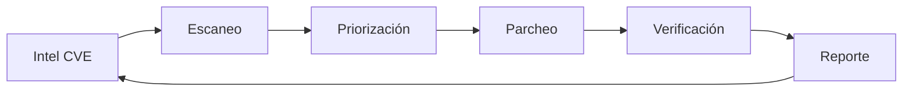

# Vulnerability Manager

## Descripción General

Ciclo de vida de gestión de vulnerabilidades integrado con operaciones CSIRT/SOC. Este skill cubre el proceso completo: inteligencia de CVEs → escaneo → priorización → parcheo → reporting → correlación.

**Flujo de trabajo VM:**



**Responsabilidades clave:**
- Monitoreo continuo de fuentes de inteligencia (NVD, CISA KEV, Exploit-DB, fuentes OSINT)
- Ejecución y automatización de escaneos periódicos
- Priorización basada en CVSS + EPSS + criticidad del activo + contexto de amenaza
- Coordinación de parcheo con equipos de infraestructura
- Reportes ejecutivos y técnicos para auditoría y compliance

**Plataformas objetivo:** Arch Linux (estación de trabajo CSIRT) + Windows 11 (análisis de vulnerabilidades en entornos Microsoft)

---

## CVE Intelligence

### NVD API (National Vulnerability Database)

La API 2.0 de NVD proporciona datos estructurados de CVEs. Sin API key hay rate limiting (~5 req/30s), con key (~50 req/30s).

```bash
# Obtener CVE específico
curl -s "https://services.nvd.nist.gov/rest/json/cves/2.0?cveId=CVE-2024-3094" | jq '.vulnerabilities[0].cve'

# Buscar CVEs por palabra clave (últimos 30 días)
curl -s "https://services.nvd.nist.gov/rest/json/cves/2.0?keywordSearch=xz&lastModStartDate=$(date -d '30 days ago' +%Y-%m-%dT00:00:00.000)&lastModEndDate=$(date +%Y-%m-%dT23:59:59.999)" | jq '.vulnerabilities[].cve.id'

# Filtrar por severidad CRITICAL
curl -s "https://services.nvd.nist.gov/rest/json/cves/2.0?cvssV3Severity=CRITICAL&pubStartDate=2026-01-01T00:00:00.000&pubEndDate=2026-06-01T23:59:59.999" | jq '.vulnerabilities[] | {id: .cve.id, score: .cve.metrics.cvssMetricV31[0].cvssData.baseScore}'

# Con API key (recomendado)
curl -s -H "apiKey: NVD_API_KEY" "https://services.nvd.nist.gov/rest/json/cves/2.0?cveId=CVE-2024-3094"
```

### CVSS Scoring (v3.1 / v4.0)

**CVSS v3.1 — Métricas base:**

| Vector | Significado | Ejemplo |
|--------|-------------|---------|
| AV:N | Attack Vector: Network | Explotable remotamente |
| AV:L | Attack Vector: Local | Requiere acceso local |
| PR:N | Privileges Required: None | Sin autenticación |
| PR:L | Privileges Required: Low | Usuario básico |
| UI:R | User Interaction: Required | Requiere interacción del usuario |
| S:C | Scope: Changed | Impacto en componente distinto |

**Rangos de severidad:**

| Severidad | CVSS v3.1 |
|-----------|-----------|
| NONE | 0.0 |
| LOW | 0.1 – 3.9 |
| MEDIUM | 4.0 – 6.9 |
| HIGH | 7.0 – 8.9 |
| CRITICAL | 9.0 – 10.0 |

**Cálculo manual desde vector:**

```bash
# Parsear vector CVSS y extraer métricas
CVE_ID="CVE-2024-3094"
curl -s "https://services.nvd.nist.gov/rest/json/cves/2.0?cveId=$CVE_ID" | jq -r '
  .vulnerabilities[0].cve.metrics.cvssMetricV31[0].cvssData |
  "Vector: \(.vectorString)\nScore: \(.baseScore)\nSeverity: \(.baseSeverity)\nAV:\(.attackVector) AC:\(.attackComplexity) PR:\(.privilegesRequired) UI:\(.userInteraction) S:\(.scope) C:\(.confidentialityImpact) I:\(.integrityImpact) A:\(.availabilityImpact)"
'
```

**CVSS v4.0 — Novedades:**

- Nueva métrica: `Safety` (S) — impacto en seguridad física
- Nueva métrica: `Automatizable` (AT) — si el ataque puede automatizarse
- Nuevas métricas ambientales mejoradas: `MSI`, `MSA`, `MSP` (Modified Safety Impact)
- Los rangos cambian ligeramente: CRITICAL sigue siendo 9.0–10.0

```bash
# Comparar CVSS v3.1 vs v4.0 para un CVE
curl -s "https://services.nvd.nist.gov/rest/json/cves/2.0?cveId=CVE-2024-3094" | jq '
  .vulnerabilities[0].cve.metrics | {
    v31: .cvssMetricV31[0].cvssData.baseScore,
    v40: .cvssMetricV40[0].cvssData.baseScore
  }'
```

### EPSS (Exploit Prediction Scoring System)

EPSS predice la probabilidad de que un CVE sea explotado en los próximos 30 días (0–1).

```bash
# Consultar EPSS para un CVE
curl -s "https://api.first.org/data/v1/epss?cve=CVE-2024-3094" | jq '.data[0]'

# Obtener CVEs con EPSS > 0.5 (alta probabilidad de explotación)
curl -s "https://api.first.org/data/v1/epss?epss-gt=0.5&limit=20" | jq '.data[].cve'

# Combinar EPSS con CVSS (priorización avanzada)
EPSS=$(curl -s "https://api.first.org/data/v1/epss?cve=CVE-2024-3094" | jq -r '.data[0].epss')
CVSS=$(curl -s "https://services.nvd.nist.gov/rest/json/cves/2.0?cveId=CVE-2024-3094" | jq -r '.vulnerabilities[0].cve.metrics.cvssMetricV31[0].cvssData.baseScore')
echo "CVE-2024-3094 | CVSS: $CVSS | EPSS: $EPSS"
```

### CISA KEV (Known Exploited Vulnerabilities)

Catálogo de vulnerabilidades que están siendo explotadas activamente.

```bash
# Descargar catálogo KEV completo
curl -s "https://www.cisa.gov/sites/default/files/feeds/known_exploited_vulnerabilities.json" | jq '.vulnerabilities[] | {cve: .cveID, vendor: .vendorProject, product: .product, date: .dateAdded, action: .requiredAction}'

# Filtrar CVEs del KEV añadidos en los últimos 7 días
curl -s "https://www.cisa.gov/sites/default/files/feeds/known_exploited_vulnerabilities.json" | jq --arg date "$(date -d '7 days ago' +%Y-%m-%d)" '.vulnerabilities[] | select(.dateAdded >= $date) | .cveID'

# Verificar si un CVE específico está en KEV
curl -s "https://www.cisa.gov/sites/default/files/feeds/known_exploited_vulnerabilities.json" | jq '[.vulnerabilities[] | select(.cveID == "CVE-2024-3094")] | length > 0'
```

### Exploit-DB / OSINT

```bash
# Buscar exploits públicos para un CVE
curl -s "https://gitlab.com/exploit-database/exploitdb/-/raw/main/files_exploits.csv" | grep -i "CVE-2024-3094"

# Usar searchsploit (local si está instalado en Arch)
searchsploit --cve CVE-2024-3094

# Búsqueda en GitHub de PoCs
# Navegador: https://github.com/search?q=CVE-2024-3094&type=repositories
```

---

## Vulnerability Scanning

### Nmap — Scripts de vulnerabilidad

```bash
# Escaneo full con NSE vulnerabilidad
nmap -sV --script vuln -p- -T4 192.168.1.100 -oA nmap_vuln_scan

# Escaneo específico con categoría vuln + safe
sudo nmap -sS -sV --script "vuln and safe" -p 1-10000 target.com

# Scripts NSE de vulnerabilidad destacados:
#   http-vuln-cve2024-   -- detecta CVEs específicos en servicios HTTP
#   smb-vuln-*           -- SMB (MS17-010, EternalBlue, etc.)
#   ssl-*                -- Heartbleed, POODLE, etc.
#   ftp-vuln-*           -- FTP específicos
#   rdp-vuln-*           -- BlueKeep (CVE-2019-0708) y otros

# Escaneo rápido de red interna
nmap -sn 10.0.0.0/24 | grep "report for" | awk '{print $5}' | while read ip; do
  nmap -sV --script vuln -p 80,443,22,3389 -T4 "$ip" -oN "scan_$ip.txt"
done

# Comparar con escaneo anterior (gestión de cambios)
ndiff scan_prev.xml scan_new.xml
```

### Nuclei — Template-based scanner

```bash
# Instalación en Arch
yay -S nuclei

# Escaneo básico
nuclei -u https://target.com -severity critical,high -o nuclei_results.txt

# Escaneo con todas las templates de CVE
nuclei -u https://target.com -t cves/ -o cve_scan.txt

# Escaneo categorizado
nuclei -u https://target.com -tags cve,rickroll -o tagged_results.txt

# Escaneo masivo desde lista de targets
nuclei -l targets.txt -severity critical -rate-limit 50 -concurrency 10

# Filtrar por CVE específico
nuclei -u https://target.com -id CVE-2024-3094

# Exportar en JSON para correlación posterior
nuclei -u https://target.com -json -o results.json

# Actualizar templates diariamente
nuclei -update-templates
```

### OpenVAS / Greenbone

```bash
# Greenbone en Arch (contenedor Docker recomendado)
docker run -d --name greenbone-community \
  -p 8080:80 -p 9390:9390 \
  -v greenbone-data:/var/lib/openvas \
  greenbone/greenbone-community-container

# CLI: gvm-cli (después de autenticar)
gvm-cli --gmp-username admin --gmp-password passwd \
  socket --socket /var/run/gvmd.sock \
  --xml '<create_task><name>Escaneo-Red-Interna</name><config_id>daba56c8-73ec-11df-a475-002264764cea</config_id><target_id>uuid-del-target</target_id></create_task>'

# Políticas de escaneo recomendadas:
#   - Full and Fast (daba56c8-73ec-11df-a475-002264764cea) — Default
#   - Discovery (8715c877-11a0-11e1-9152-406186ea4fc5) — Solo descubrimiento
#   - Host Discovery (2d3f051c-55ba-11e3-bf43-406186ea4fc5) — Ping sweep
#   - Base (d21f6c81-2bdd-11e1-a7a2-406186ea4fc5) — Sin comprobación de exploits
```

### Nessus (conceptual — requiere licencia)

```bash
# Lanzar escaneo por API (Nessus Professional)
curl -s -X POST "https://nessus-server:8834/scans" \
  -H "X-ApiKeys: accessKey=KEY; secretKey=SECRET" \
  -H "Content-Type: application/json" \
  -d '{
    "uuid": "ad629e16-03b6-8c1d-cef6-ef8c9dd3c658d24bd260ef5f9e66",
    "settings": {
      "name": "Escaneo-CRITICAL-Quincenal",
      "description": "Escaneo automático de activos críticos",
      "policy_id": 123,
      "folder_id": 5,
      "scanner_id": 1,
      "launch": "WEEKLY",
      "starttime": "20260101T020000",
      "enabled": true
    }
  }'

# Exportar reporte
curl -s -X POST "https://nessus-server:8834/scans/SCAN_ID/export" \
  -H "X-ApiKeys: accessKey=KEY; secretKey=SECRET" \
  -d '{"format": "pdf"}'
```

---

## Priorización

### Matriz de Priorización CVSS + EPSS + Criticidad del Activo

Se calcula un **puntaje compuesto** para cada vulnerabilidad:

```
Puntuación VM = (CVSS * 0.35) + (EPSS * 100 * 0.25) + (Criticidad_Activo * 0.25) + (Threat_Context * 0.15)
```

**Donde:**
- **CVSS:** 0.0 – 10.0
- **EPSS:** 0.0 – 1.0 (multiplicado por 100 para normalizar)
- **Criticidad_Activo:** 1 (bajo) – 10 (crítico — ej: DC, firewall, servidor público)
- **Threat_Context:** 1 (sin exploit conocido) – 10 (exploit activo en KEV + ransomware)

**Script de priorización:**

```bash
#!/bin/bash
# priorizar_cve.sh — Calcula puntuación VM compuesta
CVE=$1
ASSET_CRIT=${2:-5}

CVSS=$(curl -s "https://services.nvd.nist.gov/rest/json/cves/2.0?cveId=$CVE" | \
  jq -r '.vulnerabilities[0].cve.metrics.cvssMetricV31[0].cvssData.baseScore // "0"')
EPSS=$(curl -s "https://api.first.org/data/v1/epss?cve=$CVE" | \
  jq -r '.data[0].epss // "0"')
KEV=$(curl -s "https://www.cisa.gov/sites/default/files/feeds/known_exploited_vulnerabilities.json" | \
  jq "[.vulnerabilities[] | select(.cveID == \"$CVE\")] | length")

THREAT_CTX=1
[ "$KEV" -gt 0 ] && THREAT_CTX=10

SCORE=$(echo "scale=2; ($CVSS * 0.35) + ($EPSS * 100 * 0.25) + ($ASSET_CRIT * 0.25) + ($THREAT_CTX * 0.15)" | bc)

echo "$CVE | CVSS: $CVSS | EPSS: $EPSS | Crit: $ASSET_CRIT | KEV: $KEV | Score: $SCORE"
```

### Tabla de Decisión

| Score VM | Prioridad | SLA | Acción |
|----------|-----------|-----|--------|
| 8.0 – 10 | **CRÍTICA** | 24h | Parcheo inmediato, ticket crítico, notificar SOC |
| 6.0 – 7.9 | **ALTA** | 72h | Ventana de parcheo planificada, monitoreo |
| 4.0 – 5.9 | **MEDIA** | 7d | Programar en ciclo mensual |
| 0.0 – 3.9 | **BAJA** | 30d | Revisar en próximo ciclo o aceptar riesgo |

### Factores de Criticidad del Activo

| Tipo de Activo | Criticidad (1-10) |
|----------------|:-----------------:|
| Controlador de Dominio / AD | 10 |
| Firewall / Gateway | 10 |
| Servidor público (web, mail, DNS) | 9 |
| Servidor de base de datos | 8 |
| Servidor de aplicaciones interno | 6 |
| Estación de trabajo CSIRT | 7 |
| Endpoint usuario estándar | 4 |
| IoT / dispositivo sin mantenimiento | 3 |

---

## Patch Management

### Linux (Arch Linux)

```bash
# Auditoría de paquetes vulnerables (CVE tracking local)
pacman -Q | while read pkg ver; do
  curl -s "https://security.archlinux.org/package/$pkg" | jq '.vulnerabilities'
done

# Alternativa: usar arch-audit (herramienta oficial Arch)
yay -S arch-audit
arch-audit          # Lista paquetes con CVEs conocidos
arch-audit -u       # Paquetes actualizables con CVEs
arch-audit --stats  # Estadísticas de vulnerabilidades

# Actualización completa del sistema
sudo pacman -Syu

# AUR updates
yay -Syu --devel
yay -Syu --timeupdate  # Forzar orden temporal

# Kernel livepatch (sin reinicio)
# Arch no tiene soporte oficial de livepatch, alternativa: kpatch
yay -S kpatch
sudo kpatch load /usr/lib/modules/$(uname -r)/kpatch.ko

# Revisar parches de seguridad específicos
pacman -Qi linux | grep "Packager"
pacman -Qi openssl | grep "Validated"

# Comprobar si un paquete específico tiene actualización de seguridad
expac -S -H M '%n: %v -> %V' | grep "openssl"
```

### Windows 11

```powershell
# Winget — Actualizaciones disponibles
winget upgrade
winget upgrade --include-unknown

# Instalar actualizaciones específicas
winget install "Microsoft Edge" --accept-source-agreements

# Windows Update (módulo PSWindowsUpdate)
Get-WUInstall -MicrosoftUpdate -AcceptAll -AutoReboot

# Listar actualizaciones instaladas
Get-HotFix | Where-Object {$_.InstalledOn -gt (Get-Date).AddDays(-30)}

# Buscar actualizaciones para un KB específico
Get-WUList -KBArticleID KB5034441

# WSUS (si está configurado)
Get-WUServer   # Muestra servidor WSUS configurado
Get-WUHistory  # Historial de actualizaciones
Invoke-WUJob -Script { Get-WUInstall -AcceptAll } -ComputerName "SRV-001" -Confirm:$false

# Suspend/Resume updates (en entornos controlados)
New-Item -Path "HKLM:\SOFTWARE\Policies\Microsoft\Windows\WindowsUpdate\AU" -Force
Set-ItemProperty -Path "HKLM:\SOFTWARE\Policies\Microsoft\Windows\WindowsUpdate\AU" -Name "NoAutoUpdate" -Value 1
```

### Reversión de parches

```bash
# Linux — Downgrade con pacman/cache
sudo pacman -U /var/cache/pacman/pkg/package-oldver.pkg.tar.zst

# Agregar paquete a IgnorePkg para evitar re-actualización
sudo sed -i 's/^#IgnorePkg =/IgnorePkg = package/' /etc/pacman.conf

# Windows — Desinstalar KB
wusa /uninstall /kb:5034441 /quiet /norestart
Get-HotFix -Id KB5034441 | Remove-WindowsPackage -Online -NoRestart
```

---

## Correlación con Stack

### Mapeo CVE ↔ Software Instalado

```bash
#!/bin/bash
# correlacionar.sh — Busca CVEs que afectan al software instalado
PKG=$1
echo "Buscando CVEs para: $PKG"
curl -s "https://services.nvd.nist.gov/rest/json/cves/2.0?keywordSearch=$PKG&pubStartDate=$(date -d '1 year ago' +%Y-%m-%dT00:00:00.000)" | \
  jq -r '.vulnerabilities[].cve | "\(.id) | \(.metrics.cvssMetricV31[0].cvssData.baseScore) | \(.descriptions[0].value)"' | \
  head -20
```

### Filtrado de Falsos Positivos

Criterios para descartar o rebajar una vulnerabilidad:

1. **No afecta a la versión instalada** — Verificar con `pacman -Qi` o `winget show`
2. **Requiere condiciones no presentes** — Ej: CVE requiere SMBv1 deshabilitado
3. **Compensado por controls** — WAF, IDS/IPS, segmentación de red
4. **CVSS base engañoso** — AV:N pero requiere autenticación en entorno cerrado

### Inventario de Activos desde el Stack

```bash
# Linux — Listar todos los paquetes instalados con versiones
pacman -Q > ~/inventario/paquetes_$(hostname)_$(date +%Y%m%d).txt

# Servicios expuestos
ss -tlnp | grep LISTEN

# Windows — Software instalado
Get-ItemProperty HKLM:\Software\Microsoft\Windows\CurrentVersion\Uninstall\* | \
  Select-Object DisplayName, DisplayVersion, Publisher | Export-Csv software_inventory.csv

# Puertos abiertos en Windows
netstat -ano | findstr LISTENING
```

---

## Reporting

### Plantilla de Reporte Técnico

```markdown
# Reporte de Vulnerabilidades — [Cliente/Entidad]
**Fecha:** $(date +%Y-%m-%d)
**Analista:** Lucciano Campassi (D4rkDr4g0n)
**Tipo:** [ ] Periódico  [ ] Incidente  [ ] Compliance

## Resumen Ejecutivo
- Total vulnerabilidades encontradas: XX
- Críticas: XX | Altas: XX | Medias: XX | Bajas: XX
- Explotables públicamente: XX
- Activos afectados: XX

## Top 5 Vulnerabilidades

| CVE | CVSS | EPSS | Activo | Estado |
|-----|------|------|--------|--------|
| CVE-XXXX-XXXX | 9.8 | 0.95 | SRV-DC-01 | Pendiente |
| ... | ... | ... | ... | ... |

## Detalle por Activo

### SRV-DC-01 (10.0.0.1)
| CVE | Severidad | EPSS | Recomendación |
|-----|-----------|------|---------------|
| ... | CRITICAL | 0.95 | Aplicar parche KBXXXX |

## Remediation Tracking

| CVE | SLA | Fecha Asignación | Responsable | Estado |
|-----|:---:|:-----------------:|:-----------:|:------:|
| ... | 24h | 2026-01-15 | Equipo Infra | Abierto |
| ... | 7d  | 2026-01-10 | Sysadmin | Cerrado |

## Anexos
- Raw scan results: `./scans/report-2026-01.ndjson`
- Evidence: `./evidence/`
```

### Generación de Reportes Automatizada

```bash
#!/bin/bash
# generate_report.sh
REPORT_DIR="$HOME/reports/$(date +%Y%m%d)"
mkdir -p "$REPORT_DIR"

# Resolver CVEs de escaneos previos
for cve in $(cat cves_to_report.txt); do
  CVSS=$(curl -s "https://services.nvd.nist.gov/rest/json/cves/2.0?cveId=$cve" | \
    jq -r '.vulnerabilities[0].cve.metrics.cvssMetricV31[0].cvssData.baseScore // "N/A"')
  EPSS=$(curl -s "https://api.first.org/data/v1/epss?cve=$cve" | \
    jq -r '.data[0].epss // "N/A"')
  echo "$cve | $CVSS | $EPSS" >> "$REPORT_DIR/cve_summary.txt"
done

# Generar CSV para importar a hoja de cálculo
echo "CVE,CVSS,EPSS,Asset,Status" > "$REPORT_DIR/report.csv"
cat "$REPORT_DIR/cve_summary.txt" >> "$REPORT_DIR/report.csv"
```

---

## Herramientas por Plataforma

| Herramienta | Linux (Arch) | Windows 11 | Uso principal |
|-------------|:------------:|:----------:|---------------|
| Nmap + NSE vuln | `nmap` (pacman) | `nmap` (winget) | Escaneo de red y scripts vuln |
| Nuclei | `yay -S nuclei` | `winget install nuclei` | Escaneo basado en templates |
| Greenbone/OpenVAS | Docker | Docker (WSL) | Escáner completo de vulnerabilidades |
| Nessus | Binario .deb (manual) | Instalador MSI | Escaneo enterprise (licencia) |
| arch-audit | `yay -S arch-audit` | N/A | Auditoría de paquetes Arch |
| PSWindowsUpdate | N/A | Módulo PS | Windows Update management |
| Winget | N/A | Nativo Windows 11 | Gestión de paquetes Windows |
| Searchsploit | `yay -S exploitdb` | WSL + exploitdb | Búsqueda local de exploits |
| CVE Binary Tool | `pip install cve-bin-tool` | `pip install cve-bin-tool` | Escaneo de binarios contra CVE |
| Trivy | `yay -S trivy` | `winget install trivy` | Escaneo de contenedores/FS |
| Grype | `yay -S grype` | `winget install grype` | Escaneo SBOM/vulnerabilidades |
| Syft | `yay -B syft` | `winget install syft` | Generación de SBOM |
| Vuls | `yay -S vuls` | WSL | Escáner agentless SSH |
| Wazuh | Docker + agente | Instalador MSI | SIEM + HIDS + VM |

### Comandos Rápidos por Herramienta Adicional

```bash
# Trivy — Escaneo de sistema de archivos
trivy fs / --severity CRITICAL,HIGH --ignore-unfixed -o trivy-report.txt

# Trivy — Escaneo de imágenes Docker
trivy image alpine:latest

# Grype — Escaneo de directorio
grype dir:/usr/local --only-fixed

# Syft — Generar SBOM en SPDX
syft dir:/ -o spdx-json=sbom.spdx.json

# Vuls — Escaneo agentless por SSH
vuls scan -config=vuls-config.toml
vuls report -format-full-json
```

---

## Integración con Obsidian

### Estructura de Vault (Personal-Vault)

```
Personal-Vault/
├── CSIRT/
│   ├── Vulnerability-Management/
│   │   ├── Reports/
│   │   │   ├── Report-2026-01-15.md
│   │   │   └── Report-2026-02-01.md
│   │   ├── CVEs/
│   │   │   ├── CVE-2024-3094.md
│   │   │   └── CVE-2026-0001.md
│   │   ├── Scans/
│   │   │   ├── Scan-2026-01-10.md
│   │   │   └── weekly-scan-template.md
│   │   ├── Assets/
│   │   │   ├── SRV-DC-01.md
│   │   │   └── FW-PROD-01.md
│   │   └── Policies/
│   │       ├── VM-Policy.md
│   │       └── SLA-Matrix.md
│   └── Threat-Intel/
│       ├── KEV-Tracker.md
│       └── Exploit-DB-Alerts.md
```

### Plantilla de Nota para CVE en Obsidian

```markdown
---
cve_id: "CVE-2024-3094"
cvss_v31: 9.1
cvss_v40: 9.4
epss: 0.97
kev: true
published: 2024-03-29
status: "pending"
tags: [cve, critical, xz, supply-chain, backdoor]
aliases: [CVE-2024-3094, xz-backdoor]
---

# CVE-2024-3094 — Backdoor en XZ Utils

## Descripción
Malicious code in liblzma (XZ Utils 5.6.0, 5.6.1) que permite ejecución remota de código no autenticada a través de SSH.

## Vector CVSS: 9.1 Critical
`CVSS:3.1/AV:N/AC:H/PR:N/UI:N/S:C/C:H/I:H/A:H`

## EPSS: 0.97 (97% probabilidad de explotación en 30 días)

## CISA KEV: ✅ Activamente explotado

## Activos Afectados
- [[arch-linux-workstation]] — OpenSSH con liblzma >= 5.6.0
- [[SRV-DC-01]] — ❌ No afectado (Debian stable no tenía versión vulnerable)

## Remediation
- [ ] Verificar versión: `pacman -Qi xz | grep Version`
- [ ] Si >= 5.6.0: degradar a `xz 5.4.6-1`
- [ ] Ejecutar: `sudo pacman -U /var/cache/pacman/pkg/xz-5.4.6-1-x86_64.pkg.tar.zst`
- [ ] Verificar: `xz --version | grep 5.4.6`
- [ ] Agregar `IgnorePkg = xz` en `/etc/pacman.conf`

## Timeline
| Fecha | Evento |
|-------|--------|
| 2024-03-29 | Publicación CVE |
| 2024-03-30 | CISA añade a KEV |
| 2024-03-31 | Parche aplicado en estaciones Arch |

## Referencias
- [NVD](https://nvd.nist.gov/vuln/detail/CVE-2024-3094)
- [CISA KEV](https://www.cisa.gov/known-exploited-vulnerabilities-catalog)
- [OSS-Fuzz analysis](https://googleprojectzero.blogspot.com/)
```

### Script de Automatización — Crear Nota de CVE desde CLI

```bash
#!/bin/bash
# cve_to_obsidian.sh
CVE=$1
VAULT="$HOME/Personal-Vault/CSIRT/Vulnerability-Management/CVEs"
mkdir -p "$VAULT"

DATA=$(curl -s "https://services.nvd.nist.gov/rest/json/cves/2.0?cveId=$CVE")
CVSS=$(echo "$DATA" | jq -r '.vulnerabilities[0].cve.metrics.cvssMetricV31[0].cvssData.baseScore // "N/A"')
DESC=$(echo "$DATA" | jq -r '.vulnerabilities[0].cve.descriptions[0].value // "No description"')

cat > "$VAULT/$CVE.md" << EOF
---
cve_id: "$CVE"
cvss: $CVSS
status: "pending"
tags: [cve]
---

# $CVE

## Descripción
$DESC

## Acciones
- [ ] Evaluar impacto en activos
- [ ] Determinar prioridad
- [ ] Coordinar parcheo
EOF

echo "Nota creada: $VAULT/$CVE.md"
```

### Dataview Queries para Obsidian

```markdown
## CVEs Críticos Pendientes (Dataview)
```dataview
TABLE cvss as CVSS, status as Estado, epss as EPSS
FROM "CSIRT/Vulnerability-Management/CVEs"
WHERE status != "closed" AND cvss >= 9.0
SORT cvss DESC
```

## Activos con CVEs Abiertos
```dataview
TABLE rows.cve_id as CVE, rows.cvss as CVSS
FROM "CSIRT/Vulnerability-Management/CVEs"
FLATTEN file.outlinks AS affected_asset
WHERE contains(affected_asset, this.file.link)
GROUP BY affected_asset
SORT rows.cvss DESC
```

## Timeline Últimos 30 Días
```dataview
TABLE published as Publicado, cvss as CVSS
FROM "CSIRT/Vulnerability-Management/CVEs"
WHERE published >= date(today) - dur(30 days)
SORT published DESC
```
```

---

## Flujo de Trabajo Diario

```bash
# 1. Obtener CVEs críticos del día
curl -s "https://services.nvd.nist.gov/rest/json/cves/2.0?cvssV3Severity=CRITICAL&pubStartDate=$(date +%Y-%m-%d)T00:00:00.000&pubEndDate=$(date +%Y-%m-%d)T23:59:59.999" | \
  jq -r '.vulnerabilities[].cve.id' > critical_today.txt

# 2. Verificar KEV
curl -s "https://www.cisa.gov/sites/default/files/feeds/known_exploited_vulnerabilities.json" | \
  jq -r --arg date "$(date -d '7 days ago' +%Y-%m-%d)" '.vulnerabilities[] | select(.dateAdded >= $date) | .cveID' > kev_new.txt

# 3. Check EPSS alto
curl -s "https://api.first.org/data/v1/epss?epss-gt=0.5&limit=50" | \
  jq -r '.data[].cve' > high_epss.txt

# 4. Correlacionar con paquetes instalados (Arch)
for cve in $(cat critical_today.txt); do
  # Buscar si el CVE afecta a algún paquete instalado (heurística simple)
  desc=$(curl -s "https://services.nvd.nist.gov/rest/json/cves/2.0?cveId=$cve" | \
    jq -r '.vulnerabilities[0].cve.descriptions[0].value')
  for pkg in $(pacman -Q | awk '{print $1}'); do
    if echo "$desc" | grep -iq "$pkg"; then
      echo "$cve -> $pkg (INSTALADO, CRÍTICO)"
    fi
  done
done

# 5. Si hay coincidencias, crear tickets y notas
```

---

## Referencias Rápidas

| Recurso | URL |
|---------|-----|
| NVD API 2.0 Docs | https://nvd.nist.gov/developers |
| EPSS API | https://www.first.org/epss/api |
| CISA KEV Feed | https://www.cisa.gov/known-exploited-vulnerabilities-catalog |
| Exploit-DB | https://www.exploit-db.com |
| Arch CVE Tracker | https://security.archlinux.org |
| CVSS v3.1 Calculator | https://www.first.org/cvss/calculator/3.1 |
| CVSS v4.0 Calculator | https://www.first.org/cvss/calculator/4.0 |
| Nuclei Templates | https://github.com/projectdiscovery/nuclei-templates |
| Greenbone Community | https://greenbone.github.io/docs |
| CVE Binary Tool | https://github.com/intel/cve-bin-tool |
| Trivy | https://github.com/aquasecurity/trivy |
| Grype | https://github.com/anchore/grype |
| Vuls | https://github.com/future-architect/vuls |
